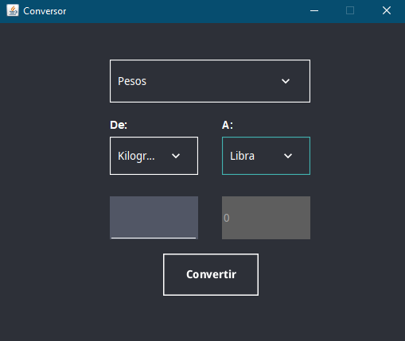

# Conversor-App

este proyecto es un conversor multiuso que te permite convertir entre diferentes unidades, incluyendo divisas, temperaturas, pesos, distancias. Con esta herramienta podrás realizar conversiones rápidas y precisas según tus necesidades


## Features

- Conversión de divisas:
    Cambia fácilmente entre diferentes monedas    con tasas de cambio.
- Conversión de temperaturas: 
    Convierte grados Celsius, Fahrenheit y Kelvin.

    NOTA: para convertir valores negativos deberas ingresarlos directamente como negativos, no podras hacer el cambio de positivos a negativos directamente en el campo donde pondras el valor a convertir  
- Conversión de pesos:
    Transformar entre unidades de peso, como kilogramos y libra.
- Conversión de distancias:
    Cambia entre kilómetros y millas con un solo click

¡Descubre la versatilidad de este conversor y simplifica tus tareas de conversion con esta practica herramienta!.


## Installation

Para ejecutar el conversor deberas tener instalado Java en tu sistema. Puedes verificar si tienes Java instalado ejecutando el siguiente comando en la terminal

```bash
  java -version
```

Si no tienes java instalado podras instalar en la web oficial de Oracle Java: [java.com](https://www.java.com/)

Con java instalado en tu sistema podras ejecutar el conversor y usar todas sus funcionalidades

Descarga el conversor: [Aqui](https://drive.google.com/file/d/1IZ6eV_tbDsHLs9upiYVVhqSvIPRpFRjP/view?usp=sharing)
## Screenshots




## Tech Stack

Java 17

Netbeans


## Authors

- [@Devkuroi](https://github.com/Devkuroi)

